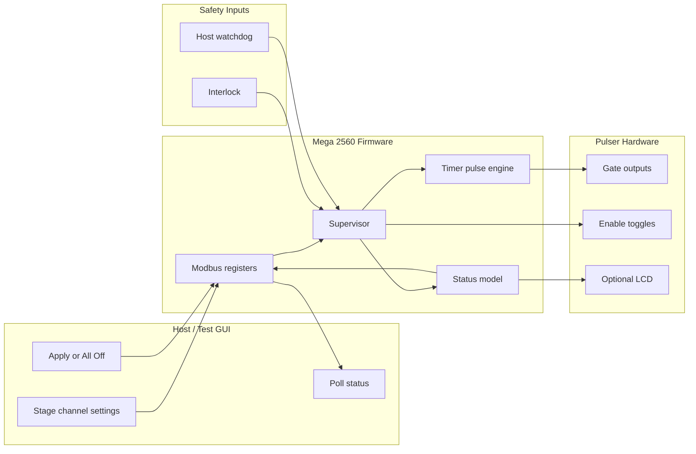
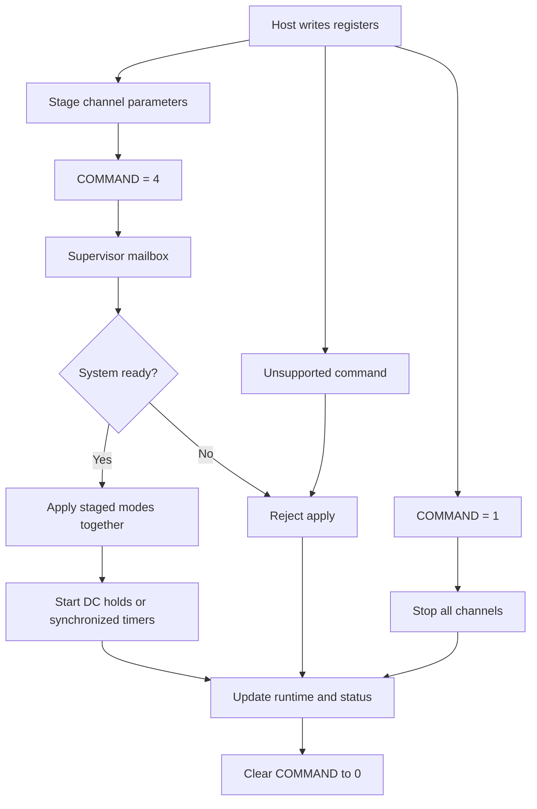

# BCON Mega Modbus Firmware

Firmware for running a 3-channel BCON beam-gate pulser from an Arduino Mega 2560. The sketch exposes a Modbus RTU instrument interface, drives gate and enable outputs, supervises interlock/watchdog safety, and is designed around a staged workflow: write channel settings, apply them together, then poll status while keeping the host heartbeat fresh.

## What The Firmware Does

- Runs as a Modbus RTU slave on an Arduino Mega 2560
- Uses RS-485 on `Serial1` by default, with optional USB serial bench mode
- Controls three gate outputs and three enable-toggle outputs
- Supports `Off`, `DC`, single-pulse, and pulse-train channel modes
- Stages channel modes before applying them, so multiple pulse channels can start together
- Generates pulse timing with hardware timers and compare ISRs
- Forces outputs low when the active-high interlock is not asserted
- Uses a software watchdog fed by host Modbus activity
- Enables the AVR hardware watchdog for local lockup recovery
- Publishes GUI-compatible status plus additive supervisor command/status telemetry
- Optionally displays watchdog, interlock, and channel state on a 20x4 I2C LCD

## Main Files

- [BCON_mega_modbus/BCON_mega_modbus.ino](BCON_mega_modbus/BCON_mega_modbus.ino): main firmware, Modbus register callbacks, supervisor, timer pulse engine, GPIO, safety loop, and LCD support
- [BCON_mega_modbus/bcon_types.h](BCON_mega_modbus/bcon_types.h): shared enums and state structs
- [EBEAM_dashboard/instrumentctl/BCON/bcon_driver.py](../EBEAM_dashboard/instrumentctl/BCON/bcon_driver.py): dashboard backend driver; raw-pyserial Modbus RTU master, background poller, write queue, and register cache
- [test_interfaces/pulser_test_gui.py](test_interfaces/pulser_test_gui.py): primary Python GUI test harness
- [test_interfaces/bcon_simple_gui.py](test_interfaces/bcon_simple_gui.py): simpler bench GUI
- [test_interfaces/bcon_simple_modbus.py](test_interfaces/bcon_simple_modbus.py): lower-level host-side Modbus helper

The main firmware paths are organized around:

- Modbus register setup and callbacks for host reads/writes
- A single-entry supervisor command mailbox for `COMMAND` writes
- Per-channel staged settings and runtime state
- A protected timer/ISR pulse engine for exact gate timing
- A safety loop that evaluates interlock and watchdog state every pass through `loop()`

## Architecture Flow

The supervisor owns command acceptance, safety decisions, and semantic status. The pulse engine owns exact gate-edge timing.

## Command Flow

`COMMAND=4` preserves the existing apply-now host workflow because the mailbox is drained inside the write callback. `loop()` also drains the mailbox as a backstop.

## Getting Started

Production defaults in [BCON_mega_modbus.ino](BCON_mega_modbus/BCON_mega_modbus.ino):

- `BCON_USE_USB_SERIAL = 0`
- `BCON_ENABLE_LCD = 1`
- Modbus RTU slave ID `1`
- `115200 8N1`
- RS-485 transport on `Serial1`
- RS-485 DE/RE control on `D17`

For bench/debug over USB serial, set `BCON_USE_USB_SERIAL` to `1`, rebuild, and upload to the Mega 2560.

## Typical Host Workflow

1. Write `CHx_PULSE_MS` and `CHx_COUNT` for each channel that will change.
2. Write staged `CHx_MODE` values.
3. Write `COMMAND=4` to apply staged modes together.
4. Poll system status and each channel status block.
5. Keep the software watchdog fresh by polling `SYS_STATE` or writing `COMMAND=0`.
6. Write `COMMAND=1` to stop all channels and clear staged modes when needed.

Channel runtime status blocks must be read separately as `110-118`, `120-128`, and `130-138`. The channel stride is 10, but offset `+9` is not implemented, so contiguous reads across `119` or `129` are rejected.

## Dashboard Driver Integration

The EBEAM dashboard backend uses `BCONDriver` in `instrumentctl/BCON/bcon_driver.py` as the normal host-side integration point. It talks directly over raw pyserial Modbus RTU instead of `pymodbus`, keeps a thread-safe register cache, and runs a background loop that processes queued writes before polling status.

The driver and firmware are expected to work together this way:

- Connect at slave ID `1`, `115200 8N1`.
- After opening the serial port, wait for the Mega boot/reset window before sending frames. The dashboard driver currently waits `4.5 s`, flushes serial buffers, writes `WATCHDOG_MS`, then validates communication with a read of registers `0-2`.
- Send UI actions through the driver's write queue when possible. The poll thread serializes Modbus traffic, runs queued writes first, then refreshes the register cache.
- Use staged channel control. High-level driver calls write pulse parameters, write `CHx_MODE`, then send `COMMAND=4`.
- Use `sync_start()` when multiple channels must begin together. It stages all requested channel modes first, then sends a single `COMMAND=4`.
- Use `COMMAND=1` for all-off. The driver also sends this during disconnect before closing the port.
- Use `CHx_ENABLE_STATE` as an explicit latched state, not as a blind toggle. The firmware emits the 100 ms enable pulse only when the latched state changes.
- Confirm nonzero commands from `LAST_CMD_CODE`, `LAST_CMD_RESULT`, `LAST_REJECT_REASON`, and `LAST_CMD_SEQ`, not from the `COMMAND` register echo or queue-depth timing.
- Treat `FAULT_LATCHED`, `power_status`, `overcurrent`, and `gated` as compatibility placeholders until hardware-backed fault inputs are implemented.

The driver polls only implemented register blocks:

- `0-2`
- `10-13`, `20-23`, `30-33`
- `100-109`
- `110-118`, `120-128`, `130-138`
- `140-151`
- `152-153`

It intentionally avoids undefined gaps such as `3-9`, `14-19`, `24-29`, `119`, and `129`.

## Modes And Pulse Timing

Supported channel modes:

| Mode | Code | Behavior |
|---|---:|---|
| `Off` | `0` | Gate output low |
| `DC` | `1` | Gate output held high while the system is safe |
| `Pulse` | `2` | Single pulse when `COUNT=1` |
| `PulseTrain` | `3` | Repeating pulse train |

Pulse behavior:

- `Pulse` with `COUNT > 1` is promoted to `PulseTrain`.
- A pulse starts high immediately when applied.
- Pulse high time is `PULSE_MS`.
- Pulse-train low gap is also `PULSE_MS`.
- Timed pulses are driven by timers `3`, `4`, and `5`, not by `loop()` polling.
- `startTimersTogetherUnsafe()` synchronizes multi-channel starts.
- `handleTimerCompareBatch()` handles timer compare edges and pulse completion.

Writing `CHx_ENABLE_STATE` changes the latched enable state and emits a 100 ms pulse on that channel's enable-toggle output.

## Limits And Safety

Implemented limits and defaults:

- `WATCHDOG_MS`: `50-60000 ms`, default `1500 ms`
- Software watchdog boot grace: `8000 ms`
- `PULSE_MS`: `1-60000 ms`, default `10 ms`
- `COUNT`: `1-10000`, default `1`
- Enable-toggle pulse: `100 ms`
- AVR hardware watchdog: `8 s`

Top-level safety states:

| State | Code | Meaning |
|---|---:|---|
| `Ready` | `0` | Interlock and software watchdog are healthy; outputs may run |
| `SafeInterlock` | `1` | Interlock is not asserted; gate outputs are forced low |
| `SafeWatchdog` | `2` | Host heartbeat is stale; gate outputs are forced low |

Control-register writes feed the software watchdog. Reading `SYS_STATE` also feeds it, matching the existing GUI polling workflow. On a safety trip, the firmware stops timers, forces gates low, clears active/staged channel modes that could drive outputs, and latches affected channels as aborted.

## Key Modbus Registers

All registers are Modbus holding registers.

| Address | Name | Purpose |
|---:|---|---|
| `0` | `WATCHDOG_MS` | Software watchdog timeout |
| `1` | `TELEMETRY_MS` | Stored host poll interval hint; not enforced |
| `2` | `COMMAND` | `0=NOP`, `1=AllOff`, `4=Apply`; other nonzero values are rejected |
| `10/20/30 +0` | `CHx_MODE` | Staged requested mode |
| `10/20/30 +1` | `CHx_PULSE_MS` | Pulse duration |
| `10/20/30 +2` | `CHx_COUNT` | Pulse count |
| `10/20/30 +3` | `CHx_ENABLE_STATE` | Latched enable state, `0` or `1` |
| `100` | `SYS_STATE` | Top-level safety state; reading feeds watchdog |
| `101` | `SYS_REASON` | Mirrors `SYS_STATE` |
| `102` | `FAULT_LATCHED` | Compatibility placeholder; always `0` |
| `103` | `INTERLOCK_OK` | `1` when interlock input is high |
| `104` | `WATCHDOG_OK` | `1` when software watchdog is fresh |
| `105` | `LAST_ERROR` | Last error code; clears on read |
| `106` | `SUP_STATE` | Supervisor summary state |
| `107` | `CMD_QUEUE_DEPTH` | Pending supervisor command count, currently `0` or `1` |
| `108` | `LAST_CMD_CODE` | Most recent supervisor command |
| `109` | `LAST_CMD_RESULT` | `0=None`, `1=Queued`, `2=Executed`, `3=Rejected` |
| `110-118` | CH1 runtime status | Mode, timing, count, remaining pulses, enable state, gate level |
| `120-128` | CH2 runtime status | Same layout as CH1 |
| `130-138` | CH3 runtime status | Same layout as CH1 |
| `140-151` | Channel supervisor status | Semantic state, stop reason, complete latch, abort latch |
| `152` | `LAST_REJECT_REASON` | `0=None`, `1=InvalidCommand`, `2=QueueFull`, `3=UnsafeInterlock`, `4=UnsafeWatchdog` |
| `153` | `LAST_CMD_SEQ` | Most recent accepted command sequence ID |

Runtime status offsets for `110`, `120`, and `130`:

- `+0`: active mode
- `+1`: pulse duration
- `+2`: pulse count
- `+3`: pulses remaining
- `+4`: latched enable state
- `+5` through `+7`: placeholders, always `0`
- `+8`: current gate pin level

## Communication Notes

`COMMAND` writes are normalized into a single-entry supervisor mailbox. The mailbox is drained immediately during the Modbus write callback so legacy hosts keep apply-now behavior, and `loop()` drains it again as a backstop.

After an accepted or rejected nonzero command is processed, the firmware clears `COMMAND` back to `0`. `COMMAND=2`, `COMMAND=3`, and any other unsupported nonzero command are rejected as invalid.

The dashboard driver keeps the software watchdog fresh with regular host activity. It currently writes `WATCHDOG_MS` as a heartbeat when no other writes are pending, and it also polls `SYS_STATE`, which the firmware treats as a watchdog feed.

The optional LCD update is deferred briefly after serial traffic to reduce I2C/RS-485 interference.

## Maintenance Notes

- Keep exact pulse timing in the timer/ISR pulse engine.
- Keep host policy, command acceptance, and safety decisions in the supervisor layer.
- Keep Modbus callbacks short; route command execution through the supervisor mailbox.
- Preserve existing GUI-compatible registers when adding new telemetry.
- Treat `startTimersTogetherUnsafe()`, `handleTimerCompareBatch()`, timer register helpers, ISR entry points, and gate-edge writes as timing-critical code.
- Do not make DC outputs silently reassert after a safety trip without a fresh apply command.

## Troubleshooting

- If Modbus does not respond, confirm slave ID `1`, `115200 8N1`, transport mode, wiring, and RS-485 direction control on `D17`.
- If outputs stay low, check `INTERLOCK_OK`, `WATCHDOG_OK`, and `SYS_STATE`.
- If an apply command is rejected, check `LAST_CMD_RESULT`, `LAST_REJECT_REASON`, and `LAST_ERROR`.
- If pulse mode unexpectedly reads back as `PulseTrain`, check whether `COUNT > 1`.
- If status reads fail, read each channel runtime block separately instead of reading `110-138` as one block.
- If the Arduino build warns about `LiquidCrystal_I2C` architecture compatibility, treat it as a library metadata warning unless the LCD actually fails.

## Known Limitations

- `FAULT_LATCHED` is reserved for compatibility and always returns `0`.
- Runtime status fields `power_status`, `overcurrent`, and `gated` are placeholders and always return `0`.
- `TELEMETRY_MS` is stored but not enforced by the firmware.
- The firmware does not currently own dashboard-side arm/disarm UX semantics beyond Modbus command/status reporting.
