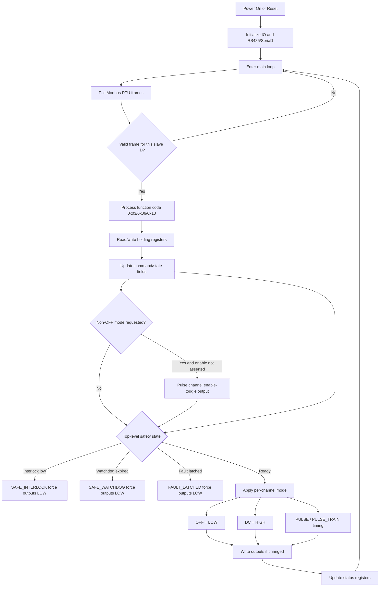

# BCON Modbus Firmware

This repository is centered on the Modbus RTU Beam Controller firmware:
- `BCON_mega_modbus.cpp`

Modbus is the **primary firmware driver**. ASCII command firmware is treated as legacy/secondary, and all active control/status communication is via Modbus RTU.

## Firmware Priority

- Primary: Modbus RTU firmware (`BCON_mega_modbus.cpp`)
- Legacy/secondary: ASCII command firmware
- New dashboard/control integrations should target the Modbus register interface.

## Serial / Modbus Settings

- Interface: RS485 half-duplex (`DE + /RE` tied to `D2`)
- UART: `Serial1` on Mega (`TX1=D18`, `RX1=D19`)
- Baud: `115200`
- Slave ID: `1` (broadcast supported on ID `0` for writes)
- Frame type: Modbus RTU, CRC16 (little-endian CRC bytes)
- Supported function codes:
  - `0x03` Read Holding Registers
  - `0x06` Write Single Register
  - `0x10` Write Multiple Registers

## Additional Output Pins (Pulser Enable Toggle)

- CH1 enable-toggle output: `D8`
- CH2 enable-toggle output: `D9`
- CH3 enable-toggle output: `D10`
- Behavior: writing the channel enable-toggle register with value `1` sends a momentary pulse on that pin.
- Safety integration: when a non-`OFF` mode is commanded and enable status is not asserted, firmware issues an enable-toggle pulse before altering gate outputs.

## Value Enums

- Channel mode values (`CHx_MODE`):
  - `0` = `OFF`
  - `1` = `DC`
  - `2` = `PULSE` (single pulse if `count <= 1`, otherwise pulse train)
  - `3` = `PULSE_TRAIN` (requires `count >= 2`)
- System state (`REG_SYS_STATE`):
  - `0` = `READY`
  - `1` = `SAFE_INTERLOCK`
  - `2` = `SAFE_WATCHDOG`
  - `3` = `FAULT_LATCHED`
- System reason (`REG_SYS_REASON`):
  - `0` = none
  - `1` = interlock low
  - `2` = watchdog expired
  - `3` = fault latched
- Last error (`REG_LAST_ERROR`):
  - `0` none, `1` illegal function, `2` illegal address, `3` illegal value, `4` device failure,
    `10` not ready, `11` fault still active, `12` interlock not ready, `13` RX buffer overflow

## Register Map (Holding Registers)

| Address | Name | R/W | Description |
|---:|---|:---:|---|
| `0` | `REG_WATCHDOG_MS` | R/W | Watchdog timeout in ms (`50..60000`) |
| `1` | `REG_TELEMETRY_MS` | R/W | Telemetry period in ms (stored; Modbus firmware does not auto-push telemetry) |
| `2` | `REG_COMMAND` | R/W | Command register (write actions below; reads as `0`) |
| `10` | `REG_CH1_MODE` | R/W | Channel 1 mode command/state |
| `11` | `REG_CH1_PULSE_MS` | R/W | Channel 1 pulse duration in ms (`1..60000`) |
| `12` | `REG_CH1_COUNT` | R/W | Channel 1 pulse count (`1..10000`) |
| `13` | `REG_CH1_ENABLE_TOGGLE` | R/W | Write `1` to send a momentary enable-toggle pulse for CH1 (reads `0`) |
| `20` | `REG_CH2_MODE` | R/W | Channel 2 mode command/state |
| `21` | `REG_CH2_PULSE_MS` | R/W | Channel 2 pulse duration in ms (`1..60000`) |
| `22` | `REG_CH2_COUNT` | R/W | Channel 2 pulse count (`1..10000`) |
| `23` | `REG_CH2_ENABLE_TOGGLE` | R/W | Write `1` to send a momentary enable-toggle pulse for CH2 (reads `0`) |
| `30` | `REG_CH3_MODE` | R/W | Channel 3 mode command/state |
| `31` | `REG_CH3_PULSE_MS` | R/W | Channel 3 pulse duration in ms (`1..60000`) |
| `32` | `REG_CH3_COUNT` | R/W | Channel 3 pulse count (`1..10000`) |
| `33` | `REG_CH3_ENABLE_TOGGLE` | R/W | Write `1` to send a momentary enable-toggle pulse for CH3 (reads `0`) |
| `100` | `REG_SYS_STATE` | R | Top-level state code |
| `101` | `REG_SYS_REASON` | R | Top-level reason code |
| `102` | `REG_FAULT_LATCHED` | R | `1` if fault latched |
| `103` | `REG_INTERLOCK_OK` | R | `1` if interlock satisfied |
| `104` | `REG_WATCHDOG_OK` | R | `1` if watchdog healthy |
| `105` | `REG_LAST_ERROR` | R | Last Modbus/internal error code |
| `110` | `CH1_STATUS_MODE` | R | Live mode code |
| `111` | `CH1_STATUS_PULSE_MS` | R | Live pulse duration |
| `112` | `CH1_STATUS_COUNT` | R | Configured pulse count |
| `113` | `CH1_STATUS_REMAINING` | R | Pulses remaining in active train |
| `114` | `CH1_STATUS_EN` | R | Enable status input (`active-low` interpreted as `1`) |
| `115` | `CH1_STATUS_PWR` | R | Power status input (`active-low` interpreted as `1`) |
| `116` | `CH1_STATUS_OC` | R | Over-current input (`active-low` interpreted as `1`) |
| `117` | `CH1_STATUS_GATED` | R | Gated status input (`active-low` interpreted as `1`) |
| `118` | `CH1_STATUS_GATE_OUT` | R | Current output level (`1`=HIGH) |
| `120..128` | `CH2_STATUS_*` | R | Same layout as CH1 |
| `130..138` | `CH3_STATUS_*` | R | Same layout as CH1 |

## Command Register (`REG_COMMAND`) Writes

- `0`: no-op
- `1`: `STOP ALL` (all channels off)
- `2`: clear fault latch (`CLEAR FAULT` equivalent)
- `3`: arm (`ARM` equivalent; currently same behavior as `2`)

Both `2` and `3` fail if over-current is still active or interlock is not ready.

## Typical Write Sequence (Pulse Train)

1. Write `CHx_PULSE_MS`
2. Write `CHx_COUNT`
3. Write `CHx_MODE = 3` (explicit train) or `2` (auto single/train based on count)

Safety gating still applies: non-`OFF` mode requests are rejected unless system state is `READY`.

For non-`OFF` mode requests, firmware also checks each channel enable-status input and emits a momentary enable-toggle pulse first when needed.

## Operation Flowchart (Modbus Primary)

