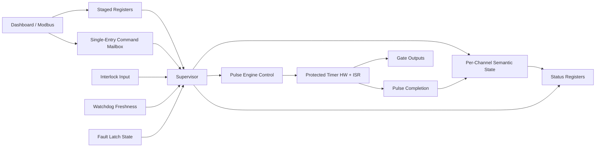
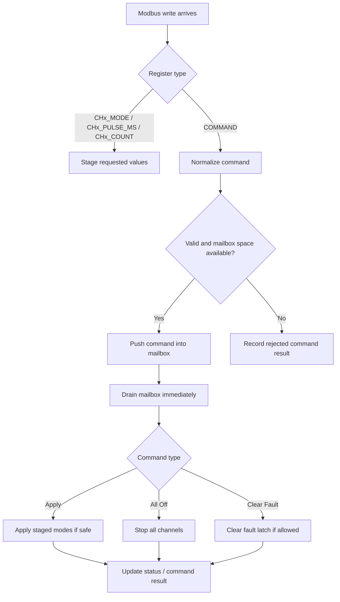
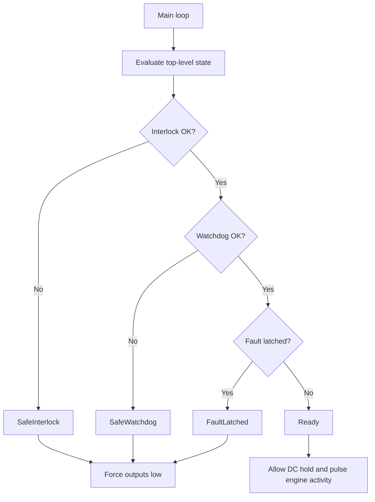
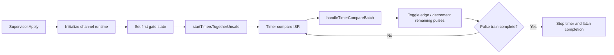

# BCON Mega Modbus Pulser Firmware

Target hardware: Arduino Mega 2560 (ATmega2560)

Primary firmware: [BCON_mega_modbus/BCON_mega_modbus.ino](BCON_mega_modbus/BCON_mega_modbus.ino)

Shared types: [BCON_mega_modbus/bcon_types.h](BCON_mega_modbus/bcon_types.h)

Related behavior notes:
- [BCON_mega_modbus/firmware_architecture_flow.md](BCON_mega_modbus/firmware_architecture_flow.md)
- [BCON_mega_modbus/BCON User Story _2026-02-15A-BW.md](<BCON_mega_modbus/BCON User Story _2026-02-15A-BW.md>)

## Overview

This firmware turns the Mega 2560 into a 3-channel Modbus RTU pulser instrument for BCON beam-gate control.

Its job is deliberately narrow:
- receive staged channel parameters and system commands over Modbus
- supervise safety and command execution
- drive the protected pulse engine
- report meaningful state back to the dashboard

It does not implement beam deflection, waveform generation for the BOP Amp, or dashboard UX behavior beyond the Modbus instrument interface.

## Current Behavior

The current branch keeps the existing timer/ISR pulse engine intact and wraps it with a supervisor-oriented control layer.

Working behaviors confirmed in the latest version:
- Modbus communication remains functional
- accurately timed pulses remain functional
- synchronized multi-channel pulse starts remain functional
- staged `CHx_MODE` writes plus `COMMAND=4` apply remain functional
- `COMMAND=1` all-off remains functional
- watchdog/interlock safety still forces outputs low
- the firmware now stages system commands through a single-entry supervisor mailbox while preserving legacy apply-now behavior on `COMMAND` writes
- additive supervisor state and command-result registers are exposed without breaking the legacy GUI register workflow

## Scope

Implemented now:
- per-channel `Off`, `DC`, `Pulse`, and `PulseTrain`
- per-channel pulse width (`PULSE_MS`) and count (`COUNT`)
- synchronized pulse starts across channels
- ordered supervisor command handling
- top-level safety gating via interlock and watchdog
- local LCD status display
- additive supervisor and command-result telemetry over Modbus

Not part of this firmware:
- beam deflection control
- BOP Amp waveform generation
- dashboard-side experiment graphing
- firmware ownership of dashboard `Arm Beams` UX

## Architecture

The design intent is to keep exact pulse timing in the protected pulse engine and move control ownership into the supervisor.

## Behavioral Flow

### 1. Command Flow

The dashboard still writes staged parameters exactly as before. `COMMAND` writes are normalized into a single-entry mailbox and then drained immediately so legacy hosts keep their existing `write COMMAND=4` -> apply-now behavior. `loop()` also drains the mailbox as a backstop.

After each accepted or rejected command, the firmware clears `COMMAND` back to `0`.

### 2. Safety Flow

Outputs are only allowed while the top-level state is `Ready`.

### 3. Pulse Execution Boundary

The pulse engine remains the timing authority. The supervisor decides when to start or stop it, but does not move pulse timing into `loop()`.

## Safety Model

Top-level safety states from [bcon_types.h](BCON_mega_modbus/bcon_types.h):

| State | Code | Meaning |
|---|---:|---|
| `Ready` | 0 | Outputs may operate |
| `SafeInterlock` | 1 | Interlock not satisfied; outputs forced low |
| `SafeWatchdog` | 2 | Heartbeat stale; outputs forced low |
| `FaultLatched` | 3 | Fault state latched; outputs forced low |

Notes:
- the software watchdog timeout is configurable through register `0` (`WATCHDOG_MS`)
- the software watchdog is treated as healthy during the first `8000 ms` after boot (`WD_BOOT_GRACE_MS`)
- the firmware also enables the AVR hardware watchdog to recover from local lockups
- the interlock input is checked every loop and blocks new output activity when not asserted
- in the current branch, DC channels are also cleared during a safety trip so they do not silently reassert after recovery without a fresh command

## Pulse Modes

Per-channel output modes from [bcon_types.h](BCON_mega_modbus/bcon_types.h):

| Mode | Code | Behavior |
|---|---:|---|
| `Off` | 0 | Gate output low |
| `DC` | 1 | Gate output held high while allowed |
| `Pulse` | 2 | Single pulse if `COUNT = 1` |
| `PulseTrain` | 3 | Repeating pulse train |

Additional mode detail:
- `Pulse` with `COUNT > 1` is elevated to `PulseTrain`
- pulse width is `PULSE_MS`
- pulse train low gap currently equals `PULSE_MS`
- pulse timing is generated by hardware timers and compare ISRs, not by loop polling

## Protected Pulse Engine

These parts of the firmware are intentionally treated as the protected timing core:
- timer setup/start/stop/schedule helpers
- `startTimersTogetherUnsafe()`
- `handleTimerCompareBatch()`
- ISR entry points
- gate-edge write timing

The supervisor refactor should continue to treat this layer as timing infrastructure, not business logic.

## Modbus Interface

Production transport:
- Modbus RTU
- slave ID `1`
- `115200 8N1`
- `Serial1` for RS-485 in production
- optional USB serial for bench/debug builds

Current build-time options in [BCON_mega_modbus.ino](BCON_mega_modbus/BCON_mega_modbus.ino):

| Macro | Meaning |
|---|---|
| `BCON_USE_USB_SERIAL` | `1` for USB serial bench mode, `0` for RS-485 production mode |
| `BCON_ENABLE_LCD` | enable or disable the 20x4 I2C LCD |

Current checked-in defaults on this branch: `BCON_USE_USB_SERIAL=1` and `BCON_ENABLE_LCD=1`.

### Control Registers

| Address | Name | Notes |
|---|---|---|
| `0` | `WATCHDOG_MS` | software watchdog timeout |
| `1` | `TELEMETRY_MS` | informational only |
| `2` | `COMMAND` | single-entry supervisor mailbox; auto-clears to `0` after processing |
| `10/20/30 +0` | `CHx_MODE` | staged requested mode |
| `10/20/30 +1` | `CHx_PULSE_MS` | pulse duration |
| `10/20/30 +2` | `CHx_COUNT` | pulse count |
| `10/20/30 +3` | `CHx_ENABLE_TOGGLE` | write `1` for 100 ms enable pulse |

### COMMAND Values

| Value | Meaning |
|---|---|
| `0` | NOP / heartbeat write |
| `1` | all off |
| `2` or `3` | clear fault if the interlock is closed |
| `4` | apply staged modes |

### Legacy System Status Registers

These remain in place for GUI compatibility.

| Address | Name | Meaning |
|---|---|---|
| `100` | `SYS_STATE` | top-level state |
| `101` | `SYS_REASON` | mirrors `SYS_STATE` |
| `102` | `FAULT_LATCHED` | latched fault flag |
| `103` | `INTERLOCK_OK` | interlock state |
| `104` | `WATCHDOG_OK` | watchdog freshness |
| `105` | `LAST_ERROR` | last error code |

### New Supervisor Status Registers

These are additive and do not replace the legacy GUI-facing registers.

| Address | Name | Meaning |
|---|---|---|
| `106` | `SUP_STATE` | overall supervisor summary state |
| `107` | `CMD_QUEUE_DEPTH` | queued supervisor commands (`0` or `1` in the current build) |
| `108` | `LAST_CMD_CODE` | most recent command code |
| `109` | `LAST_CMD_RESULT` | `0=None 1=Queued 2=Executed 3=Rejected` |
| `152` | `LAST_REJECT_REASON` | most recent reject reason |
| `153` | `LAST_CMD_SEQ` | most recent accepted command sequence id |

### Legacy Per-Channel Runtime Status

| Base | Range | Meaning |
|---|---|---|
| `110` | `110-118` | CH1 pulse-engine/runtime status |
| `120` | `120-128` | CH2 pulse-engine/runtime status |
| `130` | `130-138` | CH3 pulse-engine/runtime status |

Fields:

| Offset | Name | Meaning |
|---|---|---|
| `+0` | `mode` | active runtime mode |
| `+1` | `pulse_ms` | configured pulse duration |
| `+2` | `count` | configured pulse count |
| `+3` | `remaining` | pulses left in active train |
| `+4` | `enable_status` | currently not wired, returns `0` |
| `+5` | `power_status` | currently not wired, returns `0` |
| `+6` | `overcurrent` | currently not wired, returns `0` |
| `+7` | `gated` | currently not wired, returns `0` |
| `+8` | `output_level` | current gate pin level |

### Per-Channel Supervisor Status

| Base | Range | Meaning |
|---|---|---|
| `140` | `140-143` | CH1 semantic supervisor status |
| `144` | `144-147` | CH2 semantic supervisor status |
| `148` | `148-151` | CH3 semantic supervisor status |

Fields:

| Offset | Name | Meaning |
|---|---|---|
| `+0` | `CH_SUP_STATE` | `Off`, `Staged`, `RunningDC`, `RunningPulse`, `RunningTrain`, `Complete`, `Aborted` |
| `+1` | `CH_STOP_REASON` | most recent stop/abort reason |
| `+2` | `CH_COMPLETE` | completion latched flag |
| `+3` | `CH_ABORTED` | abort latched flag |

## Host Workflow

The existing Python GUI workflow is intentionally preserved:

1. write `PULSE_MS` / `COUNT`
2. write staged `CHx_MODE`
3. write `COMMAND=4`
4. poll `100-105` and `110-138` as before
5. optionally read `106-109` and `140-153` for richer supervisor telemetry

Recommended heartbeat behavior:
- continue polling `SYS_STATE`; in the current firmware that read also feeds the software watchdog
- `pulser_test_gui.py` currently also emits periodic `COMMAND=0` writes as defense in depth
- do not rely on a long silent interval while expecting outputs to remain enabled

## Test Interfaces

The existing host tools remain relevant:

| File | Purpose |
|---|---|
| [test_interfaces/pulser_test_gui.py](test_interfaces/pulser_test_gui.py) | primary GUI test harness |
| [test_interfaces/bcon_simple_gui.py](test_interfaces/bcon_simple_gui.py) | simpler bench GUI |
| [test_interfaces/bcon_simple_modbus.py](test_interfaces/bcon_simple_modbus.py) | lower-level host-side Modbus helper |

The current firmware branch is intended to remain usable with `pulser_test_gui.py` throughout the supervisor refactor.

## Current Limitations

A few things are intentionally still in transition:
- the pulse engine is authoritative for exact timing, while the supervisor owns command ordering and semantic reporting
- the overcurrent/fault-latch entry path is not yet fully implemented from live hardware fault inputs
- channel status fields `+4` through `+7` are placeholders and currently return `0`
- heartbeat semantics are still backward-compatible with existing GUI polling and periodic NOP writes rather than fully migrated to a dedicated supervisor heartbeat command model

## Development Guidance

If you are extending the firmware, prefer this rule:

Preserve the timer/ISR pulse engine exactly. Improve control ownership around it.

That means:
- keep exact pulse timing in the pulse engine
- keep policy and command execution in the supervisor
- keep Modbus callbacks lightweight
- expose richer state through additive registers instead of breaking existing GUI workflows

## Note on the LCD Library Warning

The Arduino build may emit a warning like:

`LiquidCrystal_I2C claims to run on all architectures and may be incompatible with avr`

That warning is from library metadata and does not, by itself, indicate a firmware problem. The current firmware targets AVR and uses the LCD only as an optional local status display.
