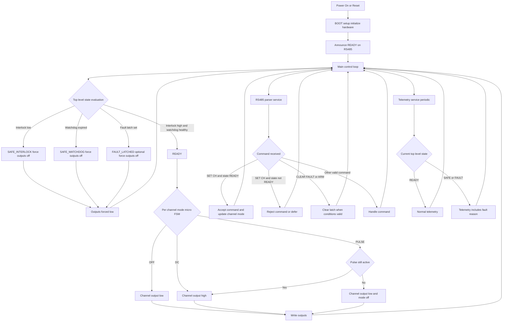

# Beam Controller (BCON)

## Description

The Beam Controller (BCON) acts as an intermediary device executing user commands from the dashboard by directly interfacing with crucial hardware components inside the lead enclosure during experimentation. The BCON system interfaces with each of three pulsers, setting the polarity on the grids and either allowing or preventing the formation of an electron beam. At the same time, the system monitors a safety interlock signal and 4 status signals from each of the pulsers.

## Inputs

- **KB_Interlock** - when low (0), pulser output should be 0. When high (1), pulser output can be remotely enabled.
- **Dashboard serial communication over RS485** - the actions of BCON are primarily driven by user-controlled software on a Python dashboard. The dashboard sets pulser output behavior as described in **Pulser Output Behavior**.
- **Pulsar status signals** - one status signal set for each of the three pulsers:
  - Enable status
  - Power status
  - Over-current status
  - Gated status

## Outputs

- **Pulser output** - one output for each of the three pulsers as described in **Pulser Output Behavior**.
- **Power LED** - an external chassis power LED should be fed when the Arduino is powered.
- **Telemetry data output (RS485)** - BCON periodically transmits system-level telemetry to the dashboard. The `SYS` line reports controller state and timing fields:
  - `state` (`READY`, `SAFE_INTERLOCK`, `SAFE_WATCHDOG`, `FAULT_LATCHED`)
  - `reason` (`NONE`, `INTERLOCK_LOW`, `WATCHDOG_EXPIRED`, `FAULT_LATCHED`)
  - `fault_latched` (`0` or `1`)
  - `telemetry_ms` (configured telemetry interval; `0` disables periodic telemetry)
- **Status output (RS485 per channel)** - BCON transmits one `CHn` status line per pulser channel containing:
  - `mode` (`OFF`, `DC`, `PULSE`)
  - `pulse_ms` (configured pulse duration)
  - `en_st` (enable status input)
  - `pwr_st` (power status input)
  - `oc_st` (over-current status input)
  - `gated_st` (gated status input)

## Pulser Output Behavior

For each pulser, the Arduino Mega outputs a 5V signal enabling the gate of a MOSFET. This allows sufficient current to be driven to the pulser gate from an external power source, enabling beam formation. BCON supports two output modes:

1. **DC** - a constant 5V feed to the pulser gate, maintaining polarity until stopped.
2. **Pulsed** - a pulse with the provided duration is output.

## Safety Watchdog

If communication is lost between the Python dashboard and BCON, the pulsers must return to negative polarity and the gate must not remain active. The watchdog timing should be easy to adjust.

## Expected Pinout (Current Firmware)

- `D2` -> RS485 transceiver `DE + /RE` (tied together, TX/RX direction control)
- `D18 (TX1)` / `D19 (RX1)` -> RS485 UART (`Serial1`) to transceiver `DI/RO`
- `D13` -> external chassis power LED (set `HIGH` in setup)
- `D22` -> `KB_Interlock` input (`HIGH` = outputs allowed, `LOW` = force outputs `LOW`)

### Pulser Gate Outputs

- Channel 1 gate output: `D5`
- Channel 2 gate output: `D6`
- Channel 3 gate output: `D7`

### Pulser Status Inputs (Active-Low, Open-Drain)

- Channel 1: `EN D23`, `PWR D24`, `OC D25`, `GATED D26`
- Channel 2: `EN D27`, `PWR D28`, `OC D29`, `GATED D30`
- Channel 3: `EN D31`, `PWR D32`, `OC D33`, `GATED D34`

## Electrical Behavior Assumptions

- Status pins are configured as `INPUT_PULLUP` (so open-drain low = asserted/true).
- Interlock pin is plain `INPUT` (no internal pull-up enabled in current config).
- Gate outputs are logic-level digital outputs (`LOW` at startup, fail-safe `LOW` on watchdog/interlock fault).

## Operation Flowchart

